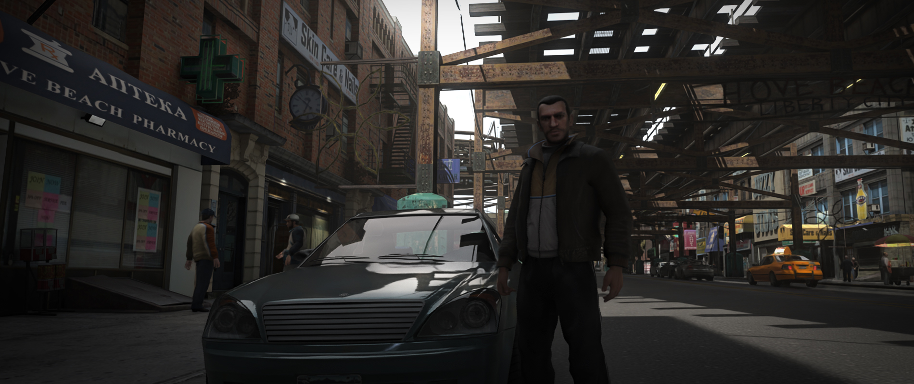

<h1 align="center">Grand Theft Auto IV - RTX Remix Compatibility Mod</h1>

 

 

Made specifically for NVIDIA's [RTX Remix](https://github.com/NVIDIAGameWorks/rtx-remix).  
Compatible with __Grand Theft Auto IV: The Complete Edition (1.2.0.59)__ 

If you want to support my work,   
consider buying me some [Coffee](https://ko-fi.com/xoxor4d) or become a [Patreon](https://patreon.com/xoxor4d)

 

 

### Table of Contents

__[Overview](#overview)__  
__[Installing](#installing)__   
__[Usage](#usage)__   
__[Compiling](#compiling)__   

 

## Overview

 

First and foremost, __this is not a remaster__. It is a mod that allows the game to be modded with NVIDIA's 
[RTX Remix](https://github.com/NVIDIAGameWorks/rtx-remix)    

There are obvious drawbacks, and things that will just not work with such a new title, so don't expect this to be perfect.  
RTX Remix has a certain overhead because of how it works and intercepts the game's draw calls.  

You'll experience CPU bottlenecks because of the amount of detailed meshes the game is rendering,  
which means that the performance you'll see in certain places is not entirely due to path tracing.  

The mod comes with a custom [remix-runtime](https://github.com/xoxor4d/dxvk-remix/tree/game/gta4) required for a few game specific features   
and with [Ultimate ASI Loader v9.0.0](https://github.com/ThirteenAG/Ultimate-ASI-Loader/releases/tag/v9.0.0) to load the compatibility mod itself. 

 

###### The good:  
- Pretty stable
- Static game objects rendered via fixed function which increases performance
- Cascaded anti culling of static objects (__wip__ - not perfect yet)
- All game lights are translated to remix light by the compatibility mod
- Dynamic emissive surfaces work (vehicle headlights, building-windows)
- Working sun
- Dynamic wetness that works similar to the original game (only outdoors and with falloff on angled surfaces)
- Translation adjustment of remix runtime variables based on timecycle settings
- Mobilephone works (but it is 3D and currently scales with the camera fov)
- Modified vertex shaders (based on FusionFix) so that remix is able to capture surface normals
- FusionFix compatible (to some degree - still causes some conflicts)

###### The bad:
- Mobilephone UI can look a little broken
- Dynamic game lights can look noisy (__wip__)
- Bad performance in certain areas (__wip__ - still need to disable many of the game's rendering features, which are useless for remix) 
- Effects can/will look bad until touched up via actual game mods
- "Fake" ambient game lights still need to be removed via actual game mods
- Anti-Culling is not perfect yet
- Particles do not render infront of the skybox (disble separate unordered approximations to fix this -> causes issues with emissives tho)
- Car dirt is not supported

 
 

## Installing
- Either grab the latest [Release](https://github.com/xoxor4d/gta4-rtx/releases) and follow the instructions found there
- Or use the latest [Action Build](https://github.com/xoxor4d/gta4-rtx/actions) and follow the install instructions for the latest release ^

> [!IMPORTANT]  
> __Usage with Fusion Fix:__
> - After installing FusionFix, copy all files from `...\GTAIV\update\common\shaders\win32_30_atidx10\`   
and paste them into `...\GTAIV\update\common\shaders\win32_30\` (overwrite)
> - Copy all files from `___for_fusionfix\plugins` into `...\GTAIV\plugins\` (overwrite)

 
 

## Usage
- Press `F4` to open the in-game gui for some compatibility tweaks or debug settings

 
 

## Compiling
- Clone the repository `git clone --recurse-submodules <URL>`
- Optional: Setup a global path variable named `GTA4_ROOT` that points to your game folder (where GTAIV.exe is located)
- Run `generate-buildfiles_vs22.bat` to generate VS project files
- Compile the mod
- If you did not setup the global path variable:  
  rename `gta4-rtx.dll` to `a_gta4-rtx.asi` and copy it into your game directory (next to `GTAIV.exe`) 
- If you have not installed a release build before, make sure to copy everything within the `assets` folder into the game directory

 
 

##  Credits
- [NVIDIA - RTX Remix](https://github.com/NVIDIAGameWorks/rtx-remix)
- [People of the showcase discord](https://discord.gg/j6sh7JD3v9) - especially the nvidia engineers ✌️
- [dear-imgui](https://github.com/ocornut/imgui)
- [imgui-blur-effect](https://github.com/3r4y/imgui-blur-effect)
- [minhook](https://github.com/TsudaKageyu/minhook)
- [toml11](https://github.com/ToruNiina/toml11)
- [Ultimate-ASI-Loader](https://github.com/ThirteenAG/Ultimate-ASI-Loader)
- [AssaultKifle47](https://github.com/akifle47)
- [FusionFix](https://github.com/ThirteenAG/GTAIV.EFLC.FusionFix)
- [FusionShaders](https://github.com/Parallellines0451/GTAIV.EFLC.FusionShaders)
- [Rage-Shader-Editor](https://github.com/ImpossibleEchoes/rage-shader-editor-cpp)
- [IV-SDK](https://github.com/Zolika1351/iv-sdk/)
- [IV-SDK-DotNet](https://github.com/ClonkAndre/IV-SDK-DotNet)
- [DayL](https://www.gtainside.de/de/user/falcogray)

 

And of course, all my fellow Ko-Fi and Patreon supporters 🍓  
and all the people that helped along the way.

