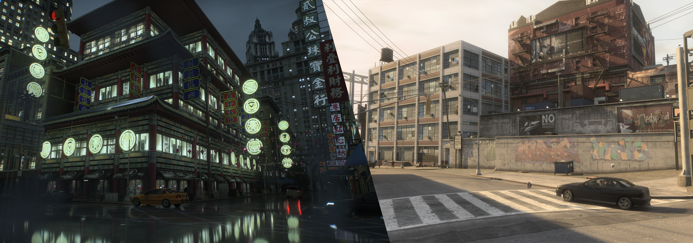
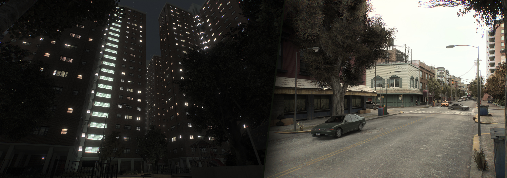
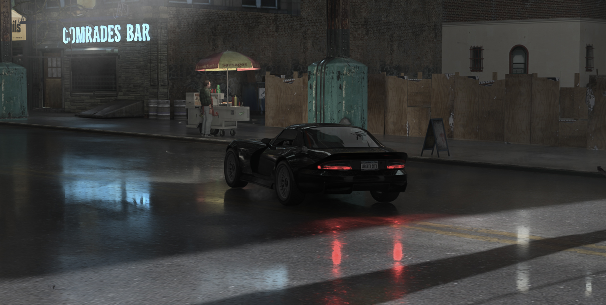

<h1 align="center">Grand Theft Auto IV - RTX Remix Compatibility Mod</h1>

 

 

Made specifically for NVIDIA's [RTX Remix](https://github.com/NVIDIAGameWorks/rtx-remix).  
Compatible with __Grand Theft Auto IV: The Complete Edition (1.2.0.59)__ 

If you want to support my work,   
consider buying me a [Coffee](https://ko-fi.com/xoxor4d) or by becoming a [Patreon](https://patreon.com/xoxor4d)

Feel free to join the discord server: https://discord.gg/FMnfhpfZy9

 

 

### Table of Contents

__[Overview](#overview)__  
__[Installing](#installing)__   
__[Uninstalling](#uninstalling)__   
__[Usage](#usage)__   
__[Compiling](#compiling)__   

 

## Overview

 

First and foremost, __this is not a remaster__. It is a mod that allows the game to be modded with NVIDIA's 
[RTX Remix](https://github.com/NVIDIAGameWorks/rtx-remix)  
It does __NOT__ come with enhanced assets. That means no PBR materials nor higher quality meshes.

 

There are obvious drawbacks, and things that will just not work with such a new title, so don't expect this to be perfect.  
RTX Remix has a certain overhead because of how it works and intercepts the game's draw calls.  

You'll experience CPU bottlenecks because of the amount of detailed meshes the game is rendering,  
which means that the performance you'll see in certain places is not entirely due to pathtracing.  

The mod comes with a custom [Remix Runtime](https://github.com/xoxor4d/dxvk-remix/tree/game/gta4_v2) required for a few game specific features   
and with [Ultimate ASI Loader](https://github.com/ThirteenAG/Ultimate-ASI-Loader/releases/tag/v9.0.0) to load the Compatibility Mod itself. 

 

###### The good:  
- Most objects rendered via fixed function to increase performance
- Cascaded anti culling of static objects (__wip__ - not perfect yet)
- All game lights (including the sun) are translated to remix light by the compatibility mod
- Ability to create overrides for translated game lights (change position, color, intensity etc.)
- Vehicles now feature two headlights and two rearlights instead of a single, centered one
- Dynamic emissive surfaces work (vehicle lights, building-windows, shops etc.)
- Dynamic wetness that works similar to the original game (only outdoors and with falloff on angled surfaces + raindrops)
- Working vehicle dirt and livery
- Modification of remix runtime variables based on current timecycle settings
- Mobilephone works (but it is 3D and currently scales with the camera fov)
- Modified vertex shaders (based on FusionFix) so that remix is able to capture surface normals
- Ability to spawn unique _marker_ meshes that can be hidden based on distance, weather or time of day (these can be used to attach remix replacements or scene lights)
- Screenshot Mode and FreeCam Mode
- FusionFix compatible (custom fork: [GTAIV.EFLC.FusionFix.RTXRemix](https://github.com/xoxor4d/GTAIV.EFLC.FusionFix.RTXRemix))
- Many many tweakable settings via the in-game __F4__ menu

###### The bad:
- CPU Bottlenecked (reduce draw distance / quality)
- Mobilephone UI can look a little broken
- Anti-Culling is not perfect yet
- Can be a little unstable
- Particles can look weird in-front of emissive surfaces (because they are tagged as "ignore transparency" to prevent flickering)
- TV's, scrolling ads etc. are not working or are static
- Raindrops/splashes on vehicles are disabled by default because they are not fully ready yet
- No blood on peds

 
 

 

 

## Installing
- Grab the latest [Release](https://github.com/xoxor4d/gta4-rtx/releases) and follow the instructions found there

> [!IMPORTANT]  
> __Usage with Fusion Fix:__
> - The original, unmodified version might cause a few issues / instability. I've made a fork of FF specifically for RTX-Remix.
> - https://github.com/xoxor4d/GTAIV.EFLC.FusionFix.RTXRemix/tree/feature/rtx-remix

 

## Uninstalling
- Deleting the `d3d9.dll` and `a_gta4-rtx.asi` should be enough
- Re-install the official FusionFix mod if you used the custom Fork

 
 

## Usage
- Run the game like normal
- Press `F4` to open the in-game gui for some compatibility tweaks or debug settings
- If you notice heavy stuttering, launch the game with the included `_LaunchWithProcessorAffinity_2Cores_GTA4.bat`.  
  Doing this will assign 2 cores to GTA4 and the rest to Remix. If you want a 50/50 split, use `_LaunchWithProcessorAffinity_Half_GTA4__Half_Remix.bat`
 
 

## Compiling
- Clone the repository `git clone --recurse-submodules <git URL>`
- Optional: Setup a global path variable named `GTA4_ROOT` that points to your game folder (where GTAIV.exe is located)
- Run `generate-buildfiles_vs22.bat` to generate VS project files
- Compile the mod
- If you did not setup the global path variable:  
  rename `gta4-rtx.dll` to `a_gta4-rtx.asi` and copy it into your game directory (next to `GTAIV.exe`) 
- If you have not installed a release build before, make sure to copy everything within the `assets` folder into the game directory

 
 

##  Credits
- [NVIDIA - RTX Remix](https://github.com/NVIDIAGameWorks/rtx-remix)
- [People of the showcase discord](https://discord.gg/j6sh7JD3v9) - especially the nvidia engineers ✌️
- [Dear ImGui](https://github.com/ocornut/imgui)
- [imgui-blur-effect](https://github.com/3r4y/imgui-blur-effect)
- [minhook](https://github.com/TsudaKageyu/minhook)
- [toml11](https://github.com/ToruNiina/toml11)
- [miniz](https://github.com/richgel999/miniz)
- [Ultimate-ASI-Loader](https://github.com/ThirteenAG/Ultimate-ASI-Loader)
- [AssaultKifle47](https://github.com/akifle47)
- [FusionFix](https://github.com/ThirteenAG/GTAIV.EFLC.FusionFix)
- [FusionShaders](https://github.com/Parallellines0451/GTAIV.EFLC.FusionShaders)
- [Rage-Shader-Editor](https://github.com/ImpossibleEchoes/rage-shader-editor-cpp)
- [IV-SDK](https://github.com/Zolika1351/iv-sdk/)
- [IV-SDK-DotNet](https://github.com/ClonkAndre/IV-SDK-DotNet)
- [DayL](https://www.gtainside.de/de/user/falcogray)
- [Entity](https://www.youtube.com/@paprykszadolowski8796)
- [Gabdeg](https://www.youtube.com/@gabdeg793)
- [Hemry](https://www.youtube.com/@Hemry81)
- All 🍓 Testers

 

And of course, all my fellow Ko-Fi and Patreon supporters  
and all the people that helped along the way!

 

