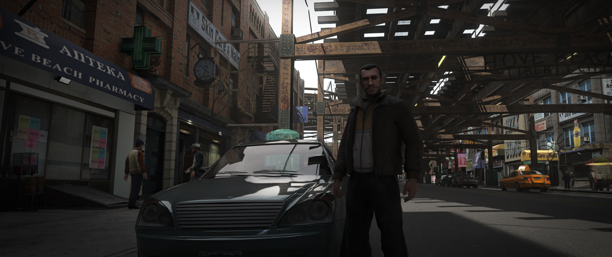
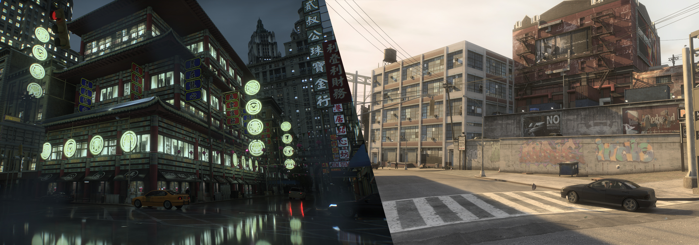
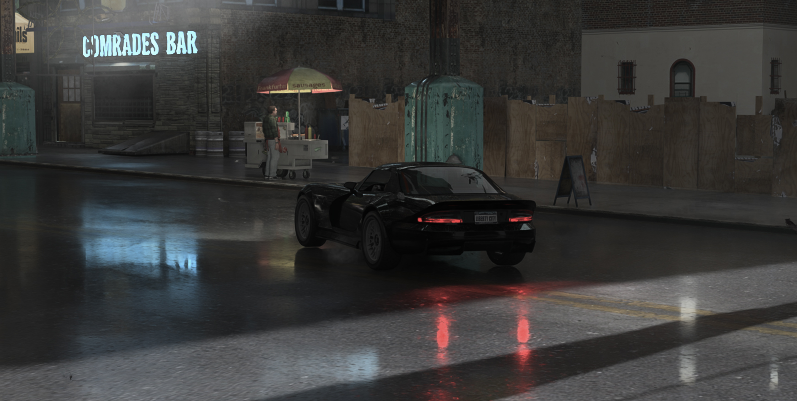
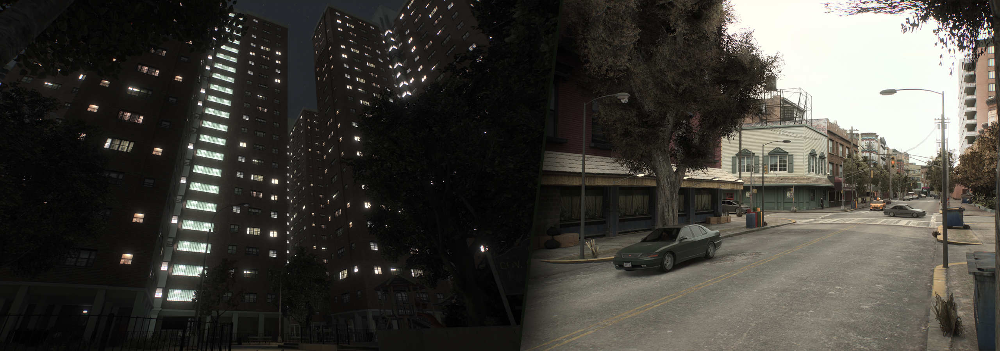

<h1 align="center">Grand Theft Auto IV - RTX Remix Compatibility Mod</h1>

 

 

Made specifically for NVIDIA's [RTX Remix](https://github.com/NVIDIAGameWorks/rtx-remix).  
Compatible with __Grand Theft Auto IV: The Complete Edition (1.2.0.59)__ 

If you want to support my work,   
consider buying me a [Coffee](https://ko-fi.com/xoxor4d) or by becoming a [Patreon](https://patreon.com/xoxor4d)

Feel free to join the discord server: https://discord.gg/FMnfhpfZy9

 

 

### Table of Contents

__[Overview](#overview)__  
__[Installing](#installing)__   
__[Uninstalling](#uninstalling)__   
__[Usage](#usage)__   
__[Compiling](#compiling)__   

 

## Overview

 

First and foremost, __this is not a remaster__. It is a mod that allows the game to be modded with NVIDIA's [RTX Remix](https://github.com/NVIDIAGameWorks/rtx-remix)  
[It comes with a Baseline Remix Mod](https://github.com/xoxor4d/gta4-rtx-base-mod) and [GTAIV-AutoPBR](https://github.com/xoxor4d/gta4-rtx-autopbr-mod).  

 

RTX Remix has a certain overhead because of how it works and intercepts the game's draw calls and   
there are obvious drawbacks and things that will not work with such a new title. Don't expect this to be perfect.  

You'll likely experience a CPU bottleneck because of the amount of detailed meshes the game is rendering.  
This means that the performance you'll see in certain places is not entirely due to pathtracing.  

 

The mod comes with a custom [Remix Runtime](https://github.com/xoxor4d/dxvk-remix/tree/game/gta4_atmos10) required for a few game specific features,   
with [Ultimate ASI Loader](https://github.com/ThirteenAG/Ultimate-ASI-Loader/releases/tag/v9.0.0) to load the Compatibility Mod itself and a custom fork of [FusionFix](https://github.com/xoxor4d/GTAIV.EFLC.FusionFix.RTXRemix) tailored for RTX-Remix.

 

###### The good:  
- **DLSS 4.5 (Ray Reconstruction 2) support**
- **DLSS 5.0 (Neural Rendering) support (if you provide the necessary dll)**
- Most objects rendered via fixed function to increase performance (compared to grabbing data from Vertexshaders)
- Cascaded anti culling of meshes
- All game lights (including the sun) are translated to remix lights
- Ability to create overrides for translated game lights (change position, color, intensity etc.)
- Vehicles now feature two headlights and two rear lights instead of single, centered ones
- Dynamic emissive surfaces work (vehicle lights, building-windows, shops etc.)
- Dynamic wetness that works similar to the original game  
  (only outdoors and with falloff on angled surfaces + raindroplets/impacts)
- Raindroplets on vehicles and character clothing
- Working vehicle dirt and livery
- Modification of remix runtime variables based on current timecycle settings
- Mobilephone works (but it is 3D and currently scales with the camera fov)
- Modified vertex shaders (based on FusionFix) so that remix is able to capture surface normals
- Ability to spawn unique _marker_ meshes that can be hidden based on distance, weather or time of day (these can be used to attach remix replacements or scene lights)
- Screenshot Mode, FreeCam Mode and other Utilities
- FusionFix compatible (custom fork: [GTAIV.EFLC.FusionFix.RTXRemix](https://github.com/xoxor4d/GTAIV.EFLC.FusionFix.RTXRemix))
- Many many tweakable settings via the in-game __F4__ menu
- A few PBR materials, hq-meshes (vegetation, modeled fences ..) and texture fixes
- Includes an Atmospheric sky system with Volumetric Clouds made by the Community [Remix Plus / Numos](https://github.com/RemixProjGroup/dxvk-remix)
- Mod Installer / Updater

###### The bad:
- CPU Bottlenecked - Nvidia is constantly updating RTX-Remix and already made changes to improve this
- Can be stuttery when traversing the world
- No blood on peds

 
 

 

 

## Installing the Mod
- Grab the latest [Release](https://github.com/xoxor4d/gta4-rtx/releases) and follow the instructions found there

## Uninstalling the Mod
- Delete `d3d9.dll` and `a_gta4-rtx.asi` or use the provided `_toggle-gta4-rtx.bat` to quickly toggle RTX-Remix
- Some other minor files remain in the updates folder (mainly `.img` files starting with `1__remix ..`)
- Re-install the official FusionFix mod if you used the custom Fork

 

## Usage
- Run the game like normal
- Press `F4` to open the in-game gui for some compatibility tweaks or debug settings
- If you notice heavy stuttering, launch the game with the included `_LaunchWithProcessorAffinity_2Cores_GTA4.bat`.  
  Doing this will assign 2 cores to GTA4 and the rest to Remix. If you want a 50/50 split, use `_LaunchWithProcessorAffinity_Half_GTA4__Half_Remix.bat`

 

> [!TIP]  
> **Troubleshooting / in-depth guides, usage information and remix runtime changes can be found in the [[Wiki]](https://github.com/xoxor4d/gta4-rtx/wiki)**

 

## Compiling
- Clone the repository `git clone --recurse-submodules https://github.com/xoxor4d/gta4-rtx.git`
- Optional: Setup a global path variable named `GTA4_ROOT` that points to your game folder (where GTAIV.exe is located)
- Run `generate-buildfiles_vs22.bat` to generate VS project files
- Compile the mod
- If you did not setup the global path variable:  
  rename `gta4-rtx.dll` to `a_gta4-rtx.asi` and copy it into your game directory (next to `GTAIV.exe`) 
- If you have not installed a release build before, make sure to copy everything within the `assets` folder into the game directory
- Make sure to also install: [gta4-rtx-base-mod](https://github.com/xoxor4d/gta4-rtx-base-mod)

 
 

##  Credits
- [NVIDIA - RTX Remix](https://github.com/NVIDIAGameWorks/rtx-remix)
- [People of the showcase discord](https://discord.gg/j6sh7JD3v9) - especially the nvidia engineers ✌️
- [Dear ImGui](https://github.com/ocornut/imgui)
- [imgui-blur-effect](https://github.com/3r4y/imgui-blur-effect)
- [minhook](https://github.com/TsudaKageyu/minhook)
- [toml11](https://github.com/ToruNiina/toml11)
- [Ultimate-ASI-Loader](https://github.com/ThirteenAG/Ultimate-ASI-Loader)
- [miniz](https://github.com/richgel999/miniz)
- [Rapidjson](https://github.com/Tencent/rapidjson)
- [DiscordRPC](https://github.com/discord/discord-rpc)
- [FusionFix](https://github.com/ThirteenAG/GTAIV.EFLC.FusionFix)
- [FusionShaders](https://github.com/Parallellines0451/GTAIV.EFLC.FusionShaders)
- [Rage-Shader-Editor](https://github.com/ImpossibleEchoes/rage-shader-editor-cpp)
- [IV-SDK](https://github.com/Zolika1351/iv-sdk/)
- [IV-SDK-DotNet](https://github.com/ClonkAndre/IV-SDK-DotNet)
- [AssaultKifle47](https://github.com/akifle47)
- [DayL](https://www.gtainside.de/de/user/falcogray)
- [Entity](https://www.youtube.com/@paprykszadolowski8796)
- [Gabdeg](https://www.youtube.com/@gabdeg793)
- [Hemry](https://www.youtube.com/@Hemry81)
- [Danlopand / Thundery_Dan](https://github.com/DANLOPAND)
- [KapibosRU](https://www.youtube.com/channel/UCqZ2NI_fQKRN-Onypt9aIGQ)
- [Budgie](https://www.patreon.com/c/BudgieGames)
- [Sparkles (Remix Plus)](https://github.com/Kim2091)
- [Alex from Digital Foundry](https://www.youtube.com/watch?v=vGxPdcMQfwg)
- All 🍓 Testers

 

And of course, all my fellow Ko-Fi and Patreon supporters  
and all the people that helped along the way!

 

